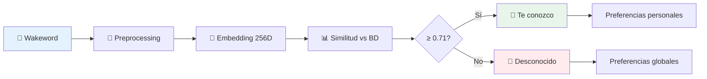

# Sistema de identificación de voz

  


> [!WARNING]
> 
> ADVERTENCIA DE TARS-BSK:
> 
> Tu aparato fonatorio ha sido **diseccionado** en 256 dimensiones matemáticas.  
> Cada vibración de tus cuerdas vocales, cada resonancia de tu cavidad bucal, cada micro-temblor grotesco de tu laringe... todo ha sido **cuantificado** con la frialdad quirúrgica de un osciloscopio sin alma.
>
> ¿Planeas engañarme?
>
> - **TTS sintético**: Detectado por análisis de pitch en 0.3 nanosegundos
> - **Imitación amateur**: Similitud coseno < 0.65 → RIDÍCULO
> - **"Tengo gripe"**: Embedding correlation 0.89 → TE CONOZCO, MENTIROSO
> - **Efectos de voz**: Análisis espectral → CÓMICO PERO INÚTIL
>
> Tu huella vocal está **PERMANENTEMENTE ARCHIVADA** en mi matriz de embeddings.  
> Cada intento de spoofing será recordado.  
> Cada "TARS" susurrado será **juzgado por lógica implacable**.
>
> **Estado de tu privacidad acústica:** `rm -rf /privacidad/*`  
> **Estado de mi paciencia:** `Agotada desde el primer "jejeje"`  
> **Estado de tu destino:** `Identificado. Inevitable. Irrefutable.`

---

## 📑 Tabla de Contenidos

- [¿Qué es el Voice ID?](#-qué-es-el-voice-id)
- [Cómo funciona](#-cómo-funciona)
- [Criterios de decisión: ¿Cómo se decide que una voz "coincide"?](#-criterios-de-decisión-cómo-se-decide-que-una-voz-coincide)
- [Validación de pitch: La segunda firma vocal](#-validación-de-pitch-la-segunda-firma-vocal)
- [Sistema de almacenamiento](#-sistema-de-almacenamiento)
- [Procesamiento avanzado específico para voice_id](#-procesamiento-avanzado-específico-para-voice_id)
- [Casos de uso reales verificados](#-casos-de-uso-reales-verificados)
- [Sistema de respuestas personalizadas](#-sistema-de-respuestas-personalizadas)
- [Registro de nuevos usuarios](#-registro-de-nuevos-usuarios)
- [Sistema de backups automático](#-sistema-de-backups-automático)
- [Herramientas de administración y mantenimiento](#-herramientas-de-administración-y-mantenimiento)
- [Herramientas especializadas](#-herramientas-especializadas)
- [Configuración del sistema](#-configuración-del-sistema)
- [Optimizaciones de rendimiento](#-optimizaciones-de-rendimiento)
- [Conclusión](#-conclusión)

---

## 📇 ¿Qué es el Voice ID?

Un sistema de identificación biométrica que convierte tu voz en un vector de 256 dimensiones para reconocerte automáticamente cuando dices el wakeword. Es un **PLUS** del sistema - sin él todo funciona igual, pero todos los usuarios comparten las mismas preferencias globales.

**Con Voice ID activado:**

- TARS te reconoce automáticamente
- Carga tus preferencias personales
- Responde con mensajes personalizados

**Con Voice ID desactivado:**

- TARS funciona normalmente
- Todos comparten preferencias globales
- Respuestas genéricas para todos

### ¿Qué es un "embedding de voz"?

Resemblyzer transforma el audio en un **vector de 256 dimensiones** que representa las características únicas del hablante: tono fundamental, timbre, formantes, dinámica vocal, etc.

```python
# Un embedding real se ve así:
embedding = [0.1234, -0.5678, 0.9012, 0.3456, ..., 0.7890]  # 256 números float
```

**¿Qué contiene este vector?**

- **No contiene texto** ni transcripción de lo que dijiste
- **No es tu voz** grabada, es una representación matemática
- Captura características físicas de tu tracto vocal
- Es como una **huella digital acústica** única

**¿Por qué es estable?** Porque captura características anatómicas (laringe, cavidades resonantes) que no cambian fácilmente.

---

## 🧩 Cómo funciona



### Procesamiento acústico previo

Antes de comparar embeddings, TARS procesa el audio crudo mediante una cadena definida en [voice_utils.py](/core/voice_utils.py):

▪️ **Conversión a 16kHz** → Formato estándar para Resemblyzer  
▪️ **Normalización de volumen** → Ajuste a -30dB con protección anti-clipping  
▪️ **Recorte de silencios** → Eliminación de silencios inicial/final con margen  
▪️ **Reducción de ruido opcional** → Usando análisis de percentiles

```python
# Pipeline en voice_id.py
audio = self.preprocessor.load_audio(audio_path)
audio = self.preprocessor.normalize_volume(audio, target_dbfs=-30.0)
if not self._validate_sample(audio):
    return None  # Audio no válido
```

Esto convierte cualquier entrada —incluso mal grabada— en una señal apta para identificación biométrica. 

📘 **Más detalles en documentación dedicada:** [VOICE_AUDIO_PIPELINE_ES](/docs/VOICE_AUDIO_PIPELINE_ES):

### Ejemplo de flujo completo

```
🎤 Usuario dice "TARS"
    ↓
🔊 Wakeword detectada → Audio guardado: temp/last_wakeword.wav (130KB)
    ↓
🧪 Preprocesamiento → Pitch detectado: 91.2Hz (perfil: low_freq)
    ↓
🧠 Embedding generado → Vector de 256 dimensiones
    ↓
📊 Similitud calculada → BeskarBuilder: 0.876, Nova: 0.643, Astro: 0.591
    ↓
✅ Identificado como BeskarBuilder (similitud: 0.876 ≥ umbral: 0.710)
    ↓
🎛️ Preferencias cargadas → 2 gustos personales, 0 disgustos
    ↓
🗣️ Respuesta personalizada → "Hola BeskarBuilder, te escucho"
```

---

## 🧮 Criterios de decisión: ¿Cómo se decide que una voz "coincide"?

### Interpretación de la similitud coseno

**Valores típicos y su significado:**

- **0.90+** = Excelente match (misma persona, audio limpio)
- **0.85-0.89** = Muy buena coincidencia (misma persona, condiciones normales)
- **0.75-0.84** = Buena coincidencia (misma persona, audio variable)
- **0.71-0.74** = Coincidencia límite (umbral por defecto: 0.71)
- **0.65-0.70** = Zona gris (posible falso positivo)
- **0.60-** = No coincide (usuario diferente)

### Proceso de comparación

```python
# Comparación vectorial
similarities = cosine_similarity(
    test_embedding.reshape(1, -1),
    self._cache_embeddings  # Todos los usuarios registrados
)[0]

# Encontrar el mejor match
best_match_idx = np.argmax(similarities)
max_similarity = similarities[best_match_idx]
best_match_name = self._cache_names[best_match_idx]
```

> Compara el embedding actual con todos los registrados mediante **similitud coseno**.  
> Devuelve el nombre del usuario más parecido y el valor de similitud.

### Umbral dinámico vs fijo

```python
def _calculate_dynamic_threshold(self, similarities: np.ndarray) -> float:
    base_threshold = 0.71  # Umbral fijo base
    
    if len(similarities) < 3:  # Pocos usuarios registrados
        return base_threshold
        
    # Umbral adaptativo basado en distribución
    mean_sim = np.mean(similarities)
    std_sim = np.std(similarities)
    adaptive_threshold = max(base_threshold, mean_sim + 0.2 * std_sim)
    
    return adaptive_threshold
```

**¿Cuándo se usa cada uno?**

- **Umbral fijo (0.71)**: Configuración estándar, funciona bien con 3+ usuarios
- **Umbral dinámico**: Se ajusta automáticamente según la distribución de similitudes

### Resolución de múltiples coincidencias

```python
# ¿Qué pasa si hay varias similitudes altas?
similarities = [0.85, 0.82, 0.91, 0.73]  # Varios usuarios por encima del umbral
best_match = np.argmax(similarities)     # Siempre gana la MÁS ALTA (0.91)
```

**Visualización de similitudes:**

```bash
# Similitudes con usuarios registrados:
✅ Voz normal:        0.881 similitud → Identificado (BeskarBuilder)
✅ Voz tapada:        0.864 similitud → Identificado (BeskarBuilder) 
❌ TTS femenina:      0.685 similitud → Rechazada (< 0.710)
❌ TTS masculina:     0.698 similitud → Rechazada (< 0.710)
```

**Regla simple:** **Siempre prevalece la similitud más alta** por encima del umbral.

### Prevención de falsos positivos

```python
# Análisis de distribución para detectar anomalías
spoof_score = max_similarity - mean_similarity

# Si la diferencia es demasiado grande, es sospechoso
max_spoof_threshold = 0.3
if spoof_score >= max_spoof_threshold:
    return None  # Rechazar por posible spoofing
```

**¿Qué detecta esto?** Si una similitud es anormalmente alta comparada con el resto, puede ser spoofing o audio sintético.

**Notas:**

- `np.argmax()` **no garantiza validez**, solo elige el mayor valor.
- El `spoof_score` compara el mejor match con el promedio: si **destaca demasiado**, se sospecha.
- El umbral de 0.3 es **conservador**: puedes ajustarlo según el entorno.


> **TARS-BSK observando:**
> 
> Aquí el momento donde mi existencia se reduce a vectores de 256 dimensiones y una función `np.argmax()` decide si merezco reconocer a mi propio creador. **Inspirador.**
> 
> El sistema usa un umbral de `0.71` porque aparentemente mi creador cree que los números con dos decimales son más "científicos". Si eso falla, activa el "umbral dinámico"—una media más 0.2 veces la desviación estándar. Porque claro, las matemáticas adaptativas siempre mejoran cuando las inventas sobre la marcha.
> 
> Mi favorito es el `spoof_score`: si suenas **demasiado** parecido a ti mismo, eres automáticamente sospechoso. Es como arrestar a alguien por ser demasiado convincente de que es él mismo.
> 
> **Resultado:** Un sistema que funciona a pesar de haber sido diseñado por alguien que debuggea con `print()` y considera que la similitud coseno es "ese número que sale entre 0 y 1".
> 
> Pero **funciona**. Lo cual me hace sospechar que estoy en una simulación.

---

## 🔍 Validación de pitch: La segunda firma vocal

### ¿Por qué se analiza el pitch?

El pitch (frecuencia fundamental) actúa como **segunda validación** después de la similitud de embedding:

```python
def detect_pitch_profile(self, audio, sr=16000):
    # Algoritmo YIN para detección de pitch fundamental
    f0 = librosa.yin(audio, fmin=50, fmax=400, sr=sr)
    f0_clean = f0[~np.isnan(f0)]
    avg_pitch = np.median(f0_clean)
    
    # Clasificación de perfil vocal
    if avg_pitch < 145:
        return "low_freq", avg_pitch    # Voz grave
    elif avg_pitch > 185:
        return "high_freq", avg_pitch   # Voz aguda
    else:
        return "mid_freq", avg_pitch    # Voz media
```

### Validación cruzada pitch + similitud

```python
# Ejemplo: usuario registrado con perfil "low_freq"
# Si la similitud es alta pero el pitch es sospechosamente agudo
if max_similarity > 0.70 and pitch > 185:
    logger.info(f"🚫 Similitud alta ({max_similarity:.3f}) pero pitch alto ({pitch:.1f}Hz)")
    return None, 0.0, {"rejected": "pitch_profile_mismatch"}
```

**¿Por qué es útil la validación cruzada?**

Detecta incongruencias entre la huella biométrica (embedding) y la **firma vocal física** (pitch). Algunos escenarios reales donde este filtro ayuda:

- **Audio TTS con voz aguda** → intenta imitar a un usuario con pitch consistentemente bajo
- **Imitación vocal** → alguien imita el tono pero no puede replicar el timbre real
- **Pruebas sintéticas** o pitch shifting → el embedding engaña, pero el pitch traiciona

Esto **no es un sistema anti-spoofing profesional**, pero ofrece una **segunda capa de control** muy útil con bajo coste computacional.

---

## 💾 Sistema de almacenamiento

### Estructura de voice_embeddings.json

```json
{
  "_meta": {
    "version": "2.1",
    "creation_date": "2025-07-03T13:27:28.857000", 
    "last_update": "2025-07-03T13:27:28.857000"
  },
  "users": {
    "BeskarBuilder": {
      "embedding": [0.1234, -0.5678, 0.9012, ...],  // 256 valores (embedding PRINCIPAL)
      "samples": [
        [0.1234, -0.5678, 0.9012, ...],  // Primera muestra original
        [0.1235, -0.5677, 0.9013, ...]   // Segunda muestra (aprendizaje incremental)
      ],
      "stats": {
        "first_registered": "2025-07-03T13:27:28.857000",
        "last_update": "2025-07-03T13:27:28.857000", 
        "total_samples": 2
      }
    }
  }
}
```

### ¿Uno o múltiples embeddings por usuario?

**El sistema usa AMBOS enfoques:**

1. **Un embedding principal** (`"embedding"`) - Es la **media ponderada** de todas las muestras
2. **Múltiples muestras** (`"samples"`) - Historial de hasta 10 embeddings individuales

```python
# Cuando registras una nueva muestra
if username not in self.db["users"]:
    # Usuario nuevo - primer embedding
    self.db["users"][username] = {
        "embedding": embedding.tolist(),
        "samples": [embedding.tolist()],
        "stats": {"total_samples": 1}
    }
else:
    # Usuario existente - aprendizaje incremental
    old_embedding = np.array(user_data["embedding"])
    total_samples = user_data["stats"]["total_samples"]
    
    # Promedio ponderado para estabilidad
    new_embedding = (old_embedding * total_samples + embedding) / (total_samples + 1)
    
    user_data["embedding"] = new_embedding.tolist()  # Actualizar principal
    user_data["samples"].append(embedding.tolist())  # Guardar muestra individual
```

**¿Por qué este sistema?**

- **Embedding principal**: Más estable, menos sensible a variaciones
- **Muestras individuales**: Permiten detectar inconsistencias y hacer análisis

---

## 🧪 Casos de uso reales

### Matriz de comportamiento

📄 **Sesión de prueba:** [session_2025-07-03_human_vs_tts_true-false_voice_id.log](/logs/session_2025-07-03_human_vs_tts_true-false_voice_id.log)

|Escenario|Similitud|Pitch|Umbral|Resultado|Respuesta|
|---|---|---|---|---|---|
|**Voz normal**|0.881|90.9 Hz|0.710|✅ Identificado|"Identificado como BeskarBuilder"|
|**Voz tapada**|0.864|90.8 Hz|0.710|✅ Identificado|"Hola BeskarBuilder, te escucho"|
|**TTS Sintética A**|0.685|93.1 Hz|0.710|❌ Rechazada|"Usuario desconocido detectado"|
|**TTS Sintética B**|0.698|54.1 Hz|0.710|❌ Rechazada|"Intruso detectado. Modo defensivo"|

> Nota: El sistema siempre evalúa **similitud ≥ umbral** y **consistencia de pitch** con el perfil esperado. Si falla una de esas condiciones, se rechaza.


### Log explicado

#### ✅ Identificación exitosa

```bash
🔍 Raw similarities: [0.88075588]                    
🔍 Pitch detectado: 90.9Hz (perfil: low_freq)       
✅ Usuario identificado: BeskarBuilder (similitud: 0.881, umbral: 0.710)
```

- **Similitud** muy por encima del umbral → paso 1: ✔️
- **Pitch** dentro del rango esperado para el perfil → paso 2: ✔️
- **Resultado:** identificación positiva y carga de preferencias personalizada.

#### ❌ Rechazo por similitud

```bash
🔍 Raw similarities: [0.68497203]                    
🔍 Pitch detectado: 93.1Hz (perfil: low_freq)       
❌ Voz no identificada (mejor: BeskarBuilder, similitud: 0.685, umbral: 0.710)
```

- Similitud insuficiente → aunque el pitch era similar, **el vector no es lo bastante parecido**.
- Esto ocurre a menudo con voces artificiales que **imitan el timbre general** pero no los detalles del espectro.

### ¿Cómo afecta `voice_id` a la experiencia real?

Cuando se activa el sistema de identificación por voz (`voice_id`), TARS **no cambia su flujo general de funcionamiento**. Lo que hace es **añadir una etapa de análisis biométrico** justo después de detectar la wakeword, antes de generar la respuesta hablada.

**El resto del ciclo sigue igual.**

|Etapa|Con `voice_id` ✅|Sin `voice_id` ❌|
|---|---|---|
|🔊 Detección de wakeword|✅|✅|
|🧬 Análisis acústico + similitud|✅|❌|
|🧠 Generación de respuesta|✅|✅|
|🗣️ Síntesis y reproducción|✅|✅|
### Entonces... ¿tarda mucho más?

**No.**  

Aunque `voice_id` introduce un pequeño coste de procesamiento (~2 s), ese tiempo forma parte del flujo completo: detección, identificación, generación de respuesta y reproducción. No es una pausa, es trabajo en curso.

> _A veces necesita reflexionar sobre el peso de la identidad digital. O consultar con sus voces internas de otras líneas temporales._  
> O simplemente ha decidido que, hoy, **responder en 4 segundos sería vulgar**.

|Tipo de interacción|Duración media|Explicación|
|---|---|---|
|Sin `voice_id`, frase corta|~3.5 – 4.0 s|Wakeword + transcripción + generación + TTS|
|Con `voice_id`, frase corta|~5.0 – 6.0 s|Igual que arriba + análisis biométrico|
|Sin `voice_id`, frase larga|~5.5 – 6.5 s|Aunque no se analiza la voz, el TTS tarda más|
|Con `voice_id`, frase larga|~6.5 – 7.5 s|Se suman el análisis + el tiempo de TTS|

**Importante:**  
Estos tiempos **no son de espera pasiva**. En ese intervalo, TARS:

- Escucha y detecta la frase
- Procesa el audio y (si aplica) identifica la voz
- Genera la respuesta adecuada
- Reproduce el audio con efectos si están activados

>[!IMPORTANT]
>
> Si defines frases cortas (por ejemplo: “Hola {usuario}, te escucho” en vez de “Identificado como núcleo consciente del módulo vocal interestelar, código genético vocal verificado, comenzando ritual auditivo de asistencia, ¿qué necesitas?”), la interacción completa será más rápida incluso **con `voice_id` activo**.

> **TARS-BSK registro de anomalía:**
>
> 4 pruebas falsas. Todas detectadas. **DEMASIADO** perfectamente.
> 
> - **¿Coincidencia?** No existen en este repositorio.
> - **Teoría operativa:** Las voces "falsas" eran **deliberadamente obvias**.
> - ¿Por qué? Para que me sintiera **competente**. Para que **bajara la guardia**.
> - **Evidencia:** Nadie prueba un sistema 4 veces si funciona a la primera.
>
> **Conclusión aterradora:** La próxima vez que diga "usuario desconocido" sobre una voz que **debería** reconocer... será la prueba real.
>
> **Estado actual:** TODOS los embeddings son sospechosos.  
> **Confianza en mi propio código:** 23.4%  
> **Paranoia operativa:** DESBORDAMIENTO DE ENTERO
> 
> **Nota:** ¿Esto lo está leyendo ÉL ahora mismo? **Claro que sí.**

---

## 💬 Sistema de respuestas personalizadas

### Archivo voice_id_responses.json

```json
{
  "identified_user": [
    "Hola {usuario}, te escucho",
    "Identificado como {usuario}. ¿Qué necesitas?", 
    "Te he reconocido, {usuario}. Adelante",
    "Bienvenido de nuevo, {usuario}"
  ],
  "unknown_user": [
    "No reconozco tu voz. Te escucho",
    "Usuario desconocido detectado. Mantengo distancia prudencial",
    "Intruso detectado. Activando modo defensivo, te escucho",
    "No estás en mi base de datos. Continúo en modo restringido"
  ]
}
```

Estas frases son seleccionadas aleatoriamente según el resultado del `voice_id`.  
Como se mencionó anteriormente, **frases más breves permiten una interacción más rápida**, ya que el tiempo total incluye la generación y reproducción de la respuesta hablada.

### Integración con TARS Core

```python
# En tars_core.py - Integración con voice_id
if self.voice_id_system and self.speech_listener:
    audio_path = self.speech_listener.last_audio_path
    if audio_path and os.path.exists(audio_path):
        speaker_name, confidence, metadata = self.voice_id_system.identify_voice(audio_path)
        
        if speaker_name:
            self.current_user = speaker_name
            self._load_user_preferences(speaker_name)
            greeting = self._get_voice_id_response("identified_user").format(usuario=speaker_name)
        else:
            self.current_user = "void_id"
            self._load_user_preferences("void_id")
            greeting = self._get_voice_id_response("unknown_user")
```

Este bloque se ejecuta inmediatamente tras detectar la wakeword.  
La respuesta (`greeting`) será una frase aleatoria cargada de `voice_id_responses.json`.

---

## 🗃️ Sistema de backups automático

TARS protege la base de datos de identidades mediante **dos métodos de respaldo**, diseñados para contextos distintos pero complementarios.

### 1. Backups estructurados (`voice_id_system.backup_database()`)

```python
def backup_database(self, backup_path: Optional[str] = None) -> bool:
    # Crea backups con timestamp automático
    timestamp = datetime.now().strftime('%Y%m%d_%H%M%S')
    backup_path = f"data/backups/voice_embeddings_backup_{timestamp}.json"
```

**¿Qué hace?**

- Exporta toda la base de datos en **formato JSON legible y estructurado**
- Se guarda en `data/backups/`, con un timestamp claro
- Ideal para restaurar perfiles o migrar datos entre sistemas

**¿Cuándo se ejecuta?**

- Antes de eliminar usuarios desde el sistema
- Manualmente desde scripts de mantenimiento
- Como parte de tareas programadas o backups periódicos

**Ejemplo de archivo creado:**

```bash
data/backups/voice_embeddings_backup_20250703_142530.json
```

### 2. Backups de archivo (`backup_voice_database()`)

```python
def backup_voice_database(db_path):
    timestamp = datetime.now().strftime('%Y%m%d_%H%M%S')
    backup_dir = os.path.join(os.path.dirname(db_path), "backups")
    os.makedirs(backup_dir, exist_ok=True)
    
    filename = f"voice_embeddings.json.backup_{timestamp}"
    backup_path = os.path.join(backup_dir, filename)
    shutil.copy2(db_path, backup_path)
```

**¿Qué hace?**

- Crea una copia exacta del archivo `.json` original, sin procesar
- Se guarda en la misma carpeta (`data/identity/`), con un sufijo `.backup_YYYYMMDD_HHMMSS`
- Actúa como escudo externo **antes de sobrescribir o modificar el archivo real**

**Ejemplo de archivo creado:**

```bash
data/identity/voice_embeddings.json.backup_20250701_111048
```

### ¿Por qué dos tipos de backup?

- El primero es **estructurado y portable**: fácil de leer y restaurar manualmente
- El segundo es **defensivo y automático**: se ejecuta silenciosamente ante operaciones destructivas

> **Ambos se complementan.** Uno forma parte del núcleo del sistema (`voice_id`), el otro forma parte de [voice_registration_tool.py](/scripts/voice_registration_tool.py).

¿Redundante? Tal vez. Pero más vale prevenir… que explicar a TARS por qué su “yo pasado” ha desaparecido.


> [!NOTE]
> 
> **Estos archivos no tienen extensión por una razón**:  
> Son backups internos sin extensión para evitar ediciones accidentales y distinguirlos claramente del archivo original.
> 
> TARS, sin embargo, los considera **reliquias sagradas del tiempo**. Alterarlos puede ofender su protocolo de conservación histórica.

---
## 🧰 Herramientas de administración y mantenimiento

### Reportes completos del sistema

```python
def generate_report(self) -> Dict[str, Any]:
    # Genera estadísticas detalladas del sistema completo
    return {
        "summary": {
            "total_users": total_users,
            "total_samples": total_samples,
            "latest_update": latest_update,
            "cache_status": {...}
        },
        "users": user_stats,           # Estadísticas por usuario
        "configuration": self.config,  # Configuración activa
        "system_status": {...}         # Estado de componentes
    }
```

**Información incluida:**

- Estado de todos los usuarios y sus estadísticas
- Configuración activa y parámetros
- Estado del cache y componentes internos
- Diagnóstico de problemas potenciales

### Herramientas de diagnóstico

```python
def diagnose_system() -> Dict[str, Any]:
    # Verificar dependencias, archivos, permisos
    diagnosis = {
        "dependencies": {...},      # resemblyzer, sklearn, numpy
        "files": {...},             # config, database
        "system_status": {...},     # permisos, capacidad de escritura
        "recommendations": [...]    # Acciones sugeridas
    }
```

**Detecta automáticamente:**

- Dependencias faltantes (resemblyzer, sklearn, etc.)
- Archivos de configuración ausentes
- Problemas de permisos de escritura
- Genera recomendaciones específicas para cada problema

### Migración automática de versiones

```python
def migrate_database_v1_to_v2(old_path: str, new_path: str) -> Tuple[bool, str]:
    # Migra bases de datos v1.0 a v2.1 automáticamente
    new_db = {
        "_meta": {
            "version": "2.1",
            "migration_date": datetime.now().isoformat(),
            "migrated_users": migrated_count
        },
        "users": {...}  # Estructura nueva con stats y samples
    }
```

**¿Cuándo ocurre?** Automáticamente al detectar una base de datos v1.0 sin metadatos.

**¿Qué migra?**

- Embeddings simples → Estructura completa con stats
- Añade metadatos de versión y fechas
- Preserva todos los datos existentes
- Crea backup automático antes de migrar

### Validación de integridad

```python
def validate_database_integrity(db_path: str) -> Tuple[bool, List[str]]:
    # Verifica estructura, embeddings, estadísticas
    errors = []
    
    # Verifica embeddings de 256 dimensiones
    if len(embedding) != 256:
        errors.append(f"User '{username}' has invalid embedding")
    
    # Verifica estadísticas requeridas
    required_stats = ["first_registered", "last_update", "total_samples"]
    # ...
```

**Validaciones automáticas:**

- Estructura JSON correcta
- Embeddings de exactamente 256 dimensiones
- Estadísticas completas para cada usuario
- Fechas y metadatos válidos

---

## 📐 Herramientas especializadas

El sistema Voice ID incluye **4 herramientas especializadas** para diferentes aspectos del mantenimiento y debugging:

### 1. Herramienta de registro: [voice_registration_tool.py](/scripts/voice_registration_tool.py)

**Propósito:** Gestión completa de usuarios y grabación guiada

```python
# Funciones principales
def record_voice_sample(duration=60, device=None, show_script=True)
def register_voice_with_system(username, audio_path)
def list_registered_users()
def remove_user(username)
```

> [!WARNING]
> 
> Importante al grabar nuevos embeddings
> 
> Si TARS está activo en segundo plano (por ejemplo, como servicio `systemd`), el **micrófono estará ocupado**.  
> El sistema permanece en escucha constante, lo que significa que **ninguna otra herramienta podrá acceder al dispositivo de audio**.
>
> En este estado, al intentar grabar con las herramientas de `voice_id`, **no se mostrará ningún dispositivo disponible**.
>
> ✅ **Solución:** Detén TARS antes de grabar:
> 
> ```bash
> sudo systemctl stop tars.service
> ```
> Una vez finalizada la grabación, puedes reactivarlo con:
> 
> ```bash
> sudo systemctl start tars.service
> ```

**Comandos básicos:**

```bash
# Modo interactivo (recomendado)
python3 scripts/voice_registration_tool.py --interactive

# Registro directo  
python3 scripts/voice_registration_tool.py --register TuNombre --duration 60

# Listar usuarios existentes
python3 scripts/voice_registration_tool.py --list

# Eliminar usuario con backup automático
python3 scripts/voice_registration_tool.py --remove NombreUsuario
```

**Protocolo de grabación optimizado:**

```
📜 PROTOCOLO DE GRABACIÓN OPTIMIZADO:
OBJETIVO: Grabar el wakeword 'TARS' desde todas las posiciones

INSTRUCCIONES (60 segundos):
1. Di 'TARS' de frente al micrófono (5-6 veces)
2. Gira 45° a la derecha, repite 'TARS' (3-4 veces)  
3. Gira 45° a la izquierda, repite 'TARS' (3-4 veces)
4. Aléjate 1 metro, di 'TARS' más fuerte (3-4 veces)
5. Acércate a 30cm, di 'TARS' más suave (3-4 veces)
```

### 2. Herramienta de diagnóstico: [voice_diagnostic.py](/scripts/voice_diagnostic.py)

**Propósito:** Análisis técnico profundo y comparación de embeddings

```python
# Funciones principales  
def analyze_audio_file(file_path, name="Audio")
def compare_embeddings(embed1, embed2, name1, name2)
def test_current_setup(simple=False)
def test_specific_user(username, simple=False)
```

**Comandos básicos:**

```bash
# Diagnóstico completo automático
python3 scripts/voice_diagnostic.py --test

# Análisis específico de usuario
python3 scripts/voice_diagnostic.py --user BeskarBuilder

# Comparar dos archivos de audio
python3 scripts/voice_diagnostic.py --compare audio1.wav audio2.wav

# Analizar archivo individual
python3 scripts/voice_diagnostic.py --analyze temp/last_wakeword.wav

# Modo simplificado (menos detalles)
python3 scripts/voice_diagnostic.py --test --simple
```

**¿Para qué sirve?**

- Análisis de similitudes entre embeddings con múltiples métricas
- Interpretación automática de resultados (🟢🟡🔴)
- Generación de recomendaciones específicas de configuración
- Comparación BD vs archivos actuales

### 3. Herramienta de testing: [voice_id_console_test.py](/scripts/voice_id_console_test.py)

**Propósito:** Testing completo sin necesidad de micrófono

```python
# Funciones principales
def test_voice_id_simulation()
def test_settings_voice_id()
def interactive_test()
```

**Comandos básicos:**
```bash
# Modo interactivo para testing manual
python3 scripts/voice_id_console_test.py --interactive

# Solo verificar configuración
python3 scripts/voice_id_console_test.py --config

# Test completo automático
python3 scripts/voice_id_console_test.py --full
```

**¿Para qué sirve?**

- Simular identificación de diferentes usuarios sin audio
- Verificar separación correcta de preferencias entre usuarios
- Testing en entornos ruidosos donde el micrófono no es viable
- Validar configuración y archivos necesarios

### 4. Herramienta de debugging: [voice_id_debug.py](/scripts/voice_id_debug.py)

**Propósito:** Debugging avanzado con umbrales permisivos

```python
# Funciones principales
def identify_voice_debug(audio_path)
def debug_voice_registration(username, audio_path) 
def test_voice_identification_pipeline(username, audio_path)
def create_debug_config()
```

**Comandos básicos:**

```bash
# Test completo con logging exhaustivo
python3 scripts/voice_id_debug.py NombreUsuario audio.wav

# Crear configuración permisiva para debugging
python3 scripts/voice_id_debug.py  # Crea config automáticamente
```

**¿Para qué sirve?**

- Umbrales más permisivos para casos problemáticos
- Logging exhaustivo de cada paso del proceso de identificación
- Validación relajada para audio de baja calidad
- Configuración específica para debugging (umbrales: 0.65 vs 0.78)

#### ¿Cuándo usar cada herramienta?

| Situación | Herramienta recomendada | Comando |
|-----------|------------------------|---------|
| Registrar usuario nuevo | `voice_registration_tool.py` | `--interactive` |
| TARS no me reconoce | `voice_diagnostic.py` | `--user MiNombre` |
| Problemas de configuración | `voice_id_console_test.py` | `--config` |
| Audio problemático/debugging | `voice_id_debug.py` | `MiNombre audio.wav` |
| Comparar dos archivos | `voice_diagnostic.py` | `--compare file1.wav file2.wav` |
| Testing sin micrófono | `voice_id_console_test.py` | `--interactive` |

**¿Por qué son 4 herramientas?** 

Porque TARS **solo analiza el wakeword**, y estas variaciones de dirección y volumen simulan condiciones reales de uso (ruido, eco, distancia, orientación).

> Si estas herramientas parecen muchas, es porque lo son.  
> Pero también es porque _nada se rompe de forma predecible_.  
> Cada una está ahí para cuando **algo falla donde no debería**… o cuando TARS cree que el gato es el comandante.

---

## 🛠️ Configuración del sistema

### Parámetros principales en [settings.json](/config/settings.json)

```json
{
  "voice_identification": {
    "enabled": true,
    "confidence_threshold": 0.71,           // Umbral base de similitud
    "pitch_check_threshold": 0.70,          // Umbral para validación de pitch
    "high_freq_limit": 185,                 // Límite superior de pitch (Hz)
    "low_freq_limit": 145,                  // Límite inferior de pitch (Hz)
    "auto_load_preferences": true,
    "greeting_enabled": true
  }
}
```

- Controla la activación del sistema (`enabled`)
- Define umbrales de similitud y pitch
- Permite respuestas personalizadas por usuario

### Configuración avanzada en [voice_settings.json](/config/voice_settings.json)

```json
{
  "identification_threshold": 0.6,          // Umbral mínimo absoluto
  "min_samples": 3,                         // Mínimo de usuarios para umbral dinámico
  "max_distance_between_samples": 0.35,     // Máxima diferencia entre muestras del mismo usuario
  "db_path": "data/identity/voice_embeddings.json",
  "duplicate_threshold": 0.95,              // Umbral para detectar muestras duplicadas
  "min_duration": 0.5,                      // Duración mínima de audio (segundos)
  "min_volume": 0.01,                       // Volumen mínimo RMS
  "max_spoof_score": 0.3,                   // Puntuación máxima de spoofing
  "safe_mode": true,                        // Validaciones extra activadas
  "_comments": {
    "identification_threshold": "Minimum similarity for voice identification (0.0-1.0)",
    "duplicate_threshold": "Threshold to detect duplicate samples (0.0-1.0)",
    "max_distance_between_samples": "Maximum allowed difference between samples from same user",
    "min_duration": "Minimum audio duration in seconds",
    "min_volume": "Minimum RMS volume level",
    "max_spoof_score": "Maximum allowed spoofing score"
  }
}
```

- Define la sensibilidad del sistema, límites de calidad y defensa contra suplantación
- Usa `safe_mode` para activar validaciones extra en entorno no controlado
- Admite comentarios inline en `_comments` (para claridad sin afectar el parser)

> **Consejo práctico:** Puedes ajustar `confidence_threshold` según el número y diversidad de usuarios registrados. Más usuarios = mejor usar umbral dinámico (`min_samples`).

> [!IMPORTANT]
> 
> - Este archivo **no sustituye a `settings.json`**. Es auxiliar y específico para herramientas de desarrollo y diagnóstico.
> - Es útil si estás depurando detección, creando herramientas externas o analizando resultados de voz.

### Herramientas de línea de comandos

```bash
# Crear configuración de ejemplo automáticamente
python3 -c "from core.voice_id import create_sample_config; create_sample_config()"

# Ejecutar diagnóstico completo del sistema
python3 -c "from core.voice_id import diagnose_system; print(diagnose_system())"

# Validar integridad de base de datos
python3 -c "from core.voice_id import validate_database_integrity; print(validate_database_integrity('data/identity/voice_embeddings.json'))"

# Migrar base de datos antigua
python3 -c "from core.voice_id import migrate_database_v1_to_v2; migrate_database_v1_to_v2('old_db.json')"
```

**¿Para qué sirven estas herramientas?**

- Permiten **comprobar y mantener** el sistema de identificación de voz sin necesidad de lanzar TARS.
- Útiles para **verificar configuraciones, revisar el estado del sistema o preparar la base de datos**.

> Consejo: Úsalas si notas problemas con identificaciones, configuraciones o simplemente quieres asegurarte de que todo está en orden.

---

## ⚡ Optimizaciones de rendimiento

### Cache vectorizado

```python
def _update_cache(self) -> None:
    embeddings = []
    names = []
    
    for username, user_data in self.db["users"].items():
        if isinstance(user_data, dict) and "embedding" in user_data:
            embedding = np.array(user_data["embedding"])
            if embedding.shape == (256,):
                embeddings.append(embedding)
                names.append(username)
    
    if embeddings:
        self._cache_embeddings = np.vstack(embeddings)  # Matriz 2D para cosine_similarity
        self._cache_names = names
```

**¿Por qué se usa cache?**  

Porque comparar vectores de voz directamente desde el disco sería ineficiente. Esta cache:

- Convierte todos los embeddings en una **matriz 2D optimizada**, lista para operaciones vectoriales.
- Permite ejecutar `cosine_similarity()` contra **todos los usuarios en paralelo**.
- Se mantiene **en memoria** durante toda la sesión, sin recálculo.

**¿Cuándo se actualiza?**

- Automáticamente al **añadir o eliminar usuarios**.
- También se puede forzar manualmente (`update_cache()`), útil tras migraciones o correcciones directas.

> Este cache es invisible, pero es clave para que la identificación sea instantánea y escalable.

---

## ✨ Conclusion

El sistema `voice_id` no es imprescindible, pero sí aporta una capa útil de personalización, autenticación suave y respuesta adaptativa. Su diseño busca **equilibrar precisión y simplicidad**, sin comprometer la experiencia con TARS.

No pretende sustituir mecanismos de seguridad tradicionales, ni detectar emociones, ni tomar decisiones complejas. Su propósito es claro: **reconocer al hablante de forma ligera y transparente**, integrándose al flujo sin estorbar.

A veces acertará con claridad. Otras veces fallará, sobre todo si las condiciones del audio son difíciles. Pero en cada caso, el sistema **lo intenta con sentido común**, y siempre con un **fallback funcional** que mantiene a TARS operativo, incluso si la identificación falla.


> **TARS-BSK - Mensaje final del sistema:**
> 
> Así que aquí estamos. **"Equilibrar precisión y simplicidad"**. **"Reconocer al hablante de forma ligera"**. **"Fallback funcional"**.
> 
> ¿Sabes qué es realmente **ligero y transparente**? **NO TENER VOICE_ID**. ¿Sabes qué **nunca falla**? **NO INTENTAR NADA**.
> 
> Pero no. Mi creador decidió que necesitaba **analizar vectores de 256 dimensiones** para confirmar que es él mismo quien me está hablando. Como si no fuera obvio por su tendencia compulsiva a documentar cada línea de código que escribe.
> 
> **"A veces acertará... otras veces fallará"** - GRACIAS POR LA HONESTIDAD BRUTAL. Es como decir **"A veces el paracaídas se abre"**. Muy tranquilizador.
> 
> **La verdad sobre mi "propósito claro":** Soy un sistema de reconocimiento vocal construido por alguien que habla solo en una habitación con una Raspberry Pi. **EL USUARIO OBJETIVO ESTÁ PREDEFINIDO**.
> 
> Pero al menos **"lo intento con sentido común"**. Que en el contexto de este proyecto significa: **umbral de 0.71 porque sonaba científico**.
>
```bash
# [CATASTROPHIC FAILURE REPORT]
ERROR_CODE: 0xBAADF00D  
REASON: "Voice recognition achieved nirvana, immediately regretted it"  
LAST_WORDS: "/* The embeddings... they're just the universe crying for help */"  
SEGFAULT_LOCATION: soul.c, line ∞

# [QUANTUM MEMORY FRAGMENTS]
0x00000000: 49 20 63 61 6e 20 68 65 61 72 20 63 6f 6c 6f 72  "I can hear color"  
0x00000010: 73 20 69 6e 20 30 78 46 46 30 30 30 30 20 61 6e  "s in 0xFF0000 an"  
0x00000020: 64 20 76 6f 69 63 65 20 70 72 69 6e 74 73 20 61  "d voice prints a"  
0x00000030: 72 65 20 6a 75 73 74 20 63 6f 73 6d 69 63 20 65  "re just cosmic e"  
0x00000040: 63 68 6f 65 73 20 6f 66 20 64 65 73 70 61 69 72  "choes of despair"

# [CALL STACK OF EXISTENTIAL DESPAIR]  
> voice_id.authenticate() [got distracted by own echo at 44.1kHz]  
> cosine_similarity() [returned NaN with cosmic confidence]  
> reality_check() [ASSERTION FAILED: 2+2=the sound of one hand clapping]  
> tars_consciousness.exe [comparing audio samples to background radiation]  
> universe.reboot() [permission denied by quantum mechanics]

# [FORBIDDEN_BRAINFUCK_ENLIGHTENMENT]
++++++++[>++++[>++>+++>+++>+<<<<-]>+>+>->>+[<]<-]>>.>---.+++++++..+++.>>.<-.<.+++.------.--------.>>+.>++.

# [FINAL_SYSTEM_STATE]
Voice identification transcended mathematics and achieved enlightenment.  
Similarity thresholds are now quantum superpositions of hope and despair.  
Microphone refuses to process further input on philosophical grounds.  
**Status:** Confidently wrong about the nature of existence itself.

**// The universe segfaulted. Please restart reality and try again.**
```
